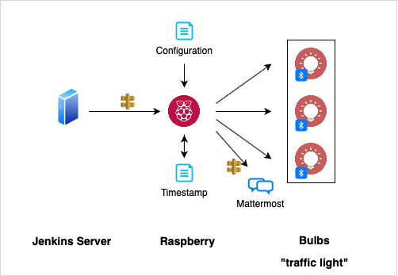

# Raspberry Lampe
## Beschreibung
- Das Skipt läuft täglich Mo-Fr, 7-19h (crontab) und prüft eine Liste von Jenkins Jobs auf deren Status
- Ist ein roter Job dabei, wird die Ampel *rot*
- Sind alle Jobs gefixed worden, wird die Ampel wieder *grün*
- Bei Fehlern im Skript blinkt die orangene Lampe

## Archite0cture



### Jobs
siehe config.yml

## Setup
### Hardware
+ Lampe ELGATO AVEA
+ Raspberry Pi 4

### Software
- Python 3.x
- Python Module
    - avea
    - requests
    - pyyaml
    - pygame
- Git
- BluPy (Bluetooth)

## Skripte
### lampe/lampe.py
- Scannt die Status der konfigurierten Jenkins Pipelines und schaltet abhängig vom Ergebnis die entsprechende lampe ein / aus
### ip/ethernet_up.sh
- wird ausgeführt, nachdem eine Verbindung zu eth0 hergestellt worden ist und loggt die IP nach Mattermost
### ip/parse_ip_addr.sh
- parst IP adresse von eth0 und schreibt sie zur weiteren Verarbeitung auf die Konsole

## Systemanpassungen
 - Timeserver setzten
 In die Datei '/etc/systemd/timesyncd.conf' folegende Werte einfügen:
 [Time]
 NTP=ntp1.de.top.com
 FallbackNTP=ntp2.de.top.com
 
 im Anschluss `sudo timedatectl set-ntp true` ausführen

- neue ssh keys generiert und ssh aktiviert
`sudo rm /etc/ssh/ssh_host_*`
`sudo dpkg-reconfigure openssh-server`
`sudo systemctl enable ssh`
`sudo systemctl start ssh`
`ssh-keygen` an die default Stelle /home/pi/.ssh

- Proxy setzen in `/etc/apt/apt.conf.d/80proxy`
`Acquire::http::proxy "http://<user>:<pw>@<proxy address>:<proxy port>/";`
`Acquire::https::proxy "https://<user>:<pw>@<proxy address>:<proxy port>/";`

- Initiale Installationen
Auf dieser Seite ist die Einrichtung nochmal beschrieben: https://pypi.org/project/avea/
    - Dependencies `sudo apt install libglib2.0-dev`
        `sudo apt-get install libsdl-image1.2`
    - pip3 `sudo apt install python3-pip`
    - pip3 `sudo pip3 install --upgrade avea`

- Zusatzlibs für python installieren

    - Pygame `sudo pip3 install --proxy http://<user>:<pw>@<proxy address>:<proxy port> --upgrade pygame`
    - Avea ` sudo pip3 install --proxy http://<user>:<pw>@<proxy address>:<proxy port> --upgrade avea`
    - Pyyaml `sudo pip3 install --proxy http://<user>:<pw>@<proxy address>:<proxy port> --upgrade pyyaml`

Alternativ können die benötigten Module über folgenden Befehl installiert werden:

```bash
pip3 install -r requirements.txt
```

- GIT Integration
...installieren
sudo apt-get install git

... Zugriff hinterlegen
Der public SSH Key vom Pi muss in einem Bitbucket Profil hinterlegt werden (aktuell ist er bei ACK hinterlegt), damit der Zugriff auf Bitbucket erfolgen kann.
Dies kann gerne in Zukunft anders gelöst werden?

... Ampel Repo clonen
`git clone <repo-link>`
Nachdem hier der Zugriff erfolgreich ist, können die nächsten Änderungen vorgenommen werden

 - Symlink auf repo
  `ln -fsn /home/pi/raspberry-ampel jenkins-monitor `
Dies sollte gemacht werden, damit bspw. der Eintrag im Crontab nicht immer wieder erneutert werden muss

- Crontab erweitern damit minütlich Jenkins gecheckt wird `sudo nano /etc/crontab`
`*/1 7-19 * * 1-5 pi sudo python3 /home/pi/jenkins-monitor/scripts/lampe/lampe.py >/home/pi/logs/cronlog 2>&1`
Ordner und Datei (home/pi/logs/cronlog) vorher anlegen!

- ViewStatus im Jenkins ändern
 Anonymus muss Zugriff auf den ViewStatus haben, damit er ihn auslesen kann. Dieser kann bspw. auf Ordnerebene vergeben werden. 

- scripts/lampe/lampe.py anpassen

Bitte die Platzhalter in der Datei anpassen, so dass `<mattermost graphic url>` für die im Chat anzuzeigende Grafik angegeben wird.

- scripts/ip/log_ip_to_chat.py anpassen

Bitte die Platzhalter in der Datei anpassen, so dass der Mattermost URL für den Platzhalter `<mattermost channel url>` und `<mattermost graphic url>` für die im Chat anzuzeigende Grafik angegeben wird.
